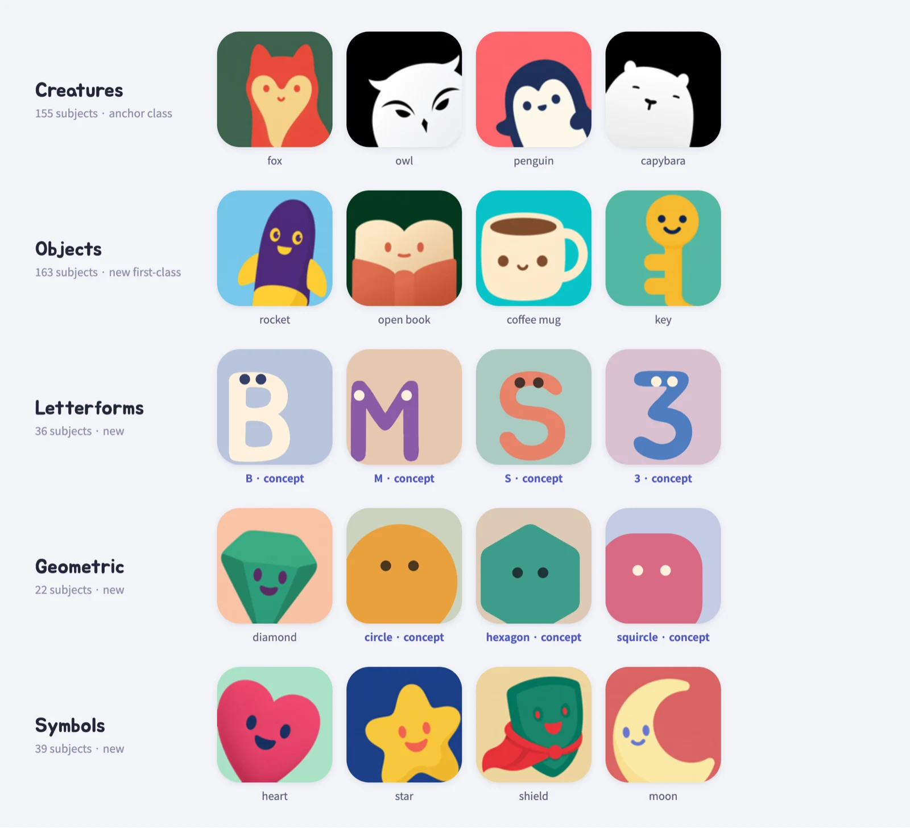

# Minimal Logo Skill

**One cute visual system, five subject classes.** `minimal-logo-skill` extends the `ip-as-logo` Agent Skill from an animal-first mascot generator into a full minimal-logo system that also designs objects, letterforms and numerals, geometric marks, and symbols — the subjects that real products actually put on their websites and app icons.



Creature, object, and symbol tiles above are real generations from the public [ipaslogo.com](https://ipaslogo.com) library. Tiles marked `concept` are SVG style mockups of the new letterform and geometric classes, which have no published generations yet.

## What this fork is built on

This repository is a fork of [s1dashu/ip-as-logo-skill](https://github.com/s1dashu/ip-as-logo-skill), a compact Agent Skill that generates extremely simple, cute, company-ready IP marks: one dominant rounded silhouette, two IP base colors plus one solid background color, a lower-corner emergence composition, and recognizability at 32 × 32. The expansion was designed from two pieces of research:

- **A full census of the public library.** All 3,448 logos (2,311 distinct subjects) on [ipaslogo.com](https://ipaslogo.com) were classified. Animals made up roughly half; objects already existed but were treated as exceptions; and the most common web/app-icon subjects were missing entirely — zero letters or digits, near-zero pure geometric shapes, and zero gear, arrow, lightning-bolt, brain, checkmark, play, or infinity marks.
- **Logo market data.** In [LOGO.com's startup icon data](https://logo.com/logos/startup-logo-maker), the most common symbols are the circuit board (~22%), network nodes (~8%), and the growth arrow (~5%), followed by the gear, shield, rocket, cloud, mountain, and lightbulb. In the standard [logo-type taxonomy](https://www.figma.com/resource-library/types-of-logos/), lettermarks and abstract geometric marks are mainstream choices for tech brands — and both were absent from the original subject space.


## What's new versus upstream

- **Five subject classes in `SKILL.md`.** A new *Subject classes* section defines creatures, objects, letterforms and numerals, geometric marks, and symbols, with per-class silhouette, legibility, cropping, and face-policy rules. Upstream reserved 95–100% of open-ended batches for familiar animals and treated objects, vehicles, and tools as non-default; this fork makes any subject first-class whenever it maps to the product.
- **A curated subject catalog.** `references/subject-catalog.md` lists 415 proven subjects (155 creatures, 163 objects, 36 letterforms and numerals, 22 geometric marks, 39 symbols) organized by class and product domain, plus domain starting points for fintech, education, developer tools, and more — roughly 2.7× the upstream animal-centric space.
- **Generalized feature rules.** The upstream *species-defining feature* became an *identity-defining feature*: one nozzle flame for a rocket, one steam wisp for a mug, one keyhole for a padlock.
- **Class-specific prompt adjustments.** The shared prompt skeleton stays intact; only the `Subject:` and `Complexity:` lines swap per class. Letterforms get open-counter and no-serif legibility constraints, geometric marks and symbols may relax the complexity floor to 1–4 shapes, and faceless marks drop the eye-and-mouth language entirely on explicit request.
- **Mixed-class direction proposals.** For open-ended requests, the skill now proposes directions across classes — typically one animal mascot, one product-relevant object or symbol, and one brand-initial letterform or geometric mark — each tied to a product attribute.

## Subject classes

Every class shares the same canvas, three-semantic-color system, corner-emergence composition, and cute rounded shape language.

| Class | Examples | Default face |
| --- | --- | --- |
| Creatures | fox, owl, octopus, ghost, robot | Always personified |
| Objects | rocket, open book, coffee mug, camera, key | Tiny face; faceless on request |
| Letterforms & numerals | `A–Z`, `0–9`, brand initial first | Tiny face; faceless on request |
| Geometric marks | circle, squircle, hexagon, blob, crescent | Tiny face; faceless on request |
| Symbols | heart, star, lightning bolt, shield, speech bubble | Tiny face; faceless on request |

## What it guides

- One dominant silhouette built from roughly 4–7 large basic shapes, relaxed to 1–4 for marks whose silhouette is the identity
- Three semantic colors by default: two IP base colors plus one background color
- Three proposed directions followed by six independently generated candidates after user approval
- Familiar animals as the anchor for open-ended mascot requests, with product-relevant objects, brand-initial letterforms, geometric marks, and symbols as first-class directions whenever they map to the product
- Context-aware, clearly separated subject colors and gently muted, slightly lower-saturation backgrounds with barely-there neo-skeuomorphic depth
- Thick, rounded forms without sharp or fragile details; glyph legibility outranks decoration for letterforms
- A large, visually dominant IP emerging flexibly from the lower-left or lower-right, with a balanced default six-image split
- Image-only generation prompts that never reveal logo, brand-mark, app-icon, or icon-asset use
- One-pass batch generation that preserves and delivers every returned image without filtering or automatic retries

## Install

Install the complete skill with the Agent Skills CLI:

```bash
npx skills@latest add t1seo/minimal-logo-skill
```

The installer detects the repository's root `SKILL.md`, lets you choose a supported coding agent, and installs the complete skill directory, including the subject catalog. Use `--global` for a personal installation available across projects:

```bash
npx skills@latest add t1seo/minimal-logo-skill --global
```

## Agent compatibility

Supported agents include **Codex, Coze, Doubao, YouMind, Manus, Gemini Apps, and Replit Agent**. The agent must have a top-tier image model: preferably GPT Image 2, or Seedance 5.0 Pro, Nano Banana Pro (Gemini Image Pro), or Nano Banana 2 (Gemini Image Flash). If none is available, enable a suitable tool or provide its API key. The skill never falls back to SVG; another image model may be used only with explicit user consent, with no guarantee of equivalent quality.

## Use

Ask your AI agent for an IP mark in any class, for example:

```text
Create a very simple, cute rounded ghost IP character on a solid deep navy background.
Create a very simple, cute rounded rocket IP character on a solid dusk purple background.
Create a cute rounded letter B character for our brand initial on a solid sage green background.
Create a cute rounded hexagon character on a solid warm sand background.
Create a faceless heart mark on a solid soft coral background.
```

When the user already names an IP subject — an animal, an object, a letter, a digit, a geometric shape, or a symbol — the skill proposes three controlled design treatments of that subject. When the subject is open, it proposes three genuinely different directions drawn from more than one subject class, each tied to a product attribute or brand promise. The curated subject space in `references/subject-catalog.md` spans 415 subjects across the five classes.

Every default candidate uses three semantic colors: two IP base colors plus one background color. A two-color image is generated only on explicit request, using background-colored negative space for facial marks. Objects, letterforms, geometric marks, and symbols follow the same cute rounded visual system as animal mascots: personified with a tiny face by default, faceless only on explicit request.

If the skill runs inside a product repository, it inspects relevant read-only context before asking questions, then always presents three concise directions and proposes generating six independent images. When the user accepts all three directions, the default batch contains two variants per direction (`A1`–`C2`) with a guaranteed three-left, three-right corner split; compatible agents may generate candidates in parallel with subagents. Every result is a separate full-resolution square asset, never a contact sheet.

The generation prompt describes only the requested square character image. It never calls the result a logo, brand mark, app icon, or icon asset. Generation is treated as a creative draw: each candidate is generated once and delivered as returned, without validation gates, automatic rejection, retries, or silent repair.

## Repository structure

```text
SKILL.md
references/subject-catalog.md
assets/subject-classes.webp
assets/ip-as-logo-wall.webp
README.md
LICENSE
```

The skill consists of a single instruction document plus one curated subject catalog that the agent consults when proposing directions. There are no scripts, style references, or generation dependencies.

## Model behavior

Image-generation models are stochastic and may interpret individual constraints differently. The skill preserves and returns every result without validation gates, transparency checks, automatic rejection, automatic retry, or silent repair.

## License

MIT
